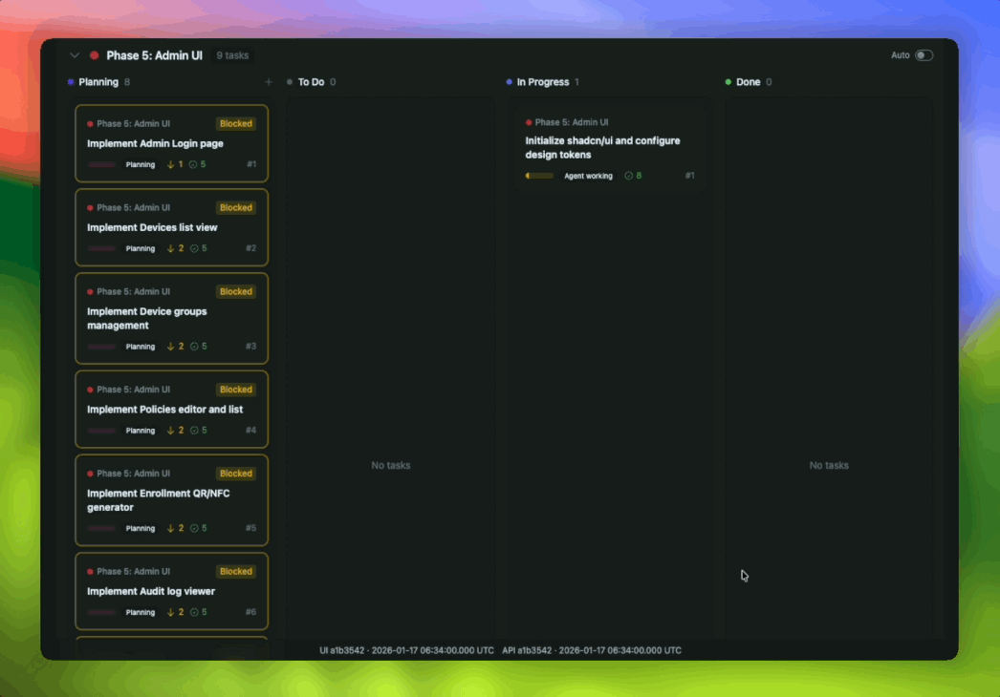

# Flux &middot; [](https://github.com/sirsjg/flux/actions/workflows/ci.yml) [](LICENSE)      

Ship with less chaos. Flux is a fast, simple Kanban board with MCP integration so your LLMs can help run the show.  Create your tasks (or let your LLM) then let you agent take you to glory.  The ultimate spec-driven vibe tool.



## Features

- **Multi-project support** - Manage multiple Kanban boards
- **Epics and Tasks** - Organize work with epics (swimlanes) and tasks
- **Dependencies** - Track task/epic dependencies with blocked indicators
- **Drag and drop** - Move tasks between columns and epics
- **Search and filters** - Find tasks by text, filter by epic or blocked status
- **MCP Server** - Allow LLMs to manage your Kanban board via Model Context Protocol
- **Real-time updates** - SSE-powered live updates when data changes
- **Webhooks** - Push notifications to external services when events occur (Slack, GitHub, CI, etc.)

## Quick Start (Docker)

macOS/Linux:

```bash
curl -fsSL https://raw.githubusercontent.com/sirsjg/flux/main/scripts/quickstart.sh | bash
```

Windows (PowerShell):

```powershell
irm https://raw.githubusercontent.com/sirsjg/flux/main/scripts/quickstart.ps1 | iex
```

Then start the MCP:

```bash
docker run -i --rm -v flux-data:/app/packages/data flux-mcp
```

Web UI is [http://localhost:3000](http://localhost:3000).

### Claude Code/Codex

Add the MCP server:

```bash
claude mcp add flux -- docker run -i --rm -v flux-data:/app/packages/data flux-mcp
```

To share the configuration with your team (creates `.mcp.json`):

```bash
claude mcp add --scope project flux -- docker run -i --rm -v flux-data:/app/packages/data flux-mcp
```

## Installation (Docker)

Docker is the recommended way to run Flux. Build the image first:

```bash
docker build -t flux-mcp .
```

### Claude Desktop

Add to your Claude Desktop configuration file:

**macOS**: `~/Library/Application Support/Claude/claude_desktop_config.json`
**Windows**: `%APPDATA%\Claude\claude_desktop_config.json`

```json
{
  "mcpServers": {
    "flux": {
      "command": "docker",
      "args": ["run", "-i", "--rm", "-v", "flux-data:/app/packages/data", "flux-mcp"]
    }
  }
}
```

Restart Claude Desktop after saving.

### Web Interface

Run the web server:

```bash
docker run -d -p 3000:3000 -v flux-data:/app/packages/data --name flux-web flux-mcp node packages/server/dist/index.js
```

Open http://localhost:3000

The web UI and MCP server share the same data volume, so changes made via Claude appear instantly in the web interface.

### Using a Local Directory for Data

To store data in a specific folder instead of a Docker volume:

```bash
mkdir -p ~/flux-data

# For Claude Desktop/Code config, use:
docker run -i --rm -v ~/flux-data:/app/packages/data flux-mcp

# For web UI:
docker run -d -p 3000:3000 -v ~/flux-data:/app/packages/data --name flux-web flux-mcp node packages/server/dist/index.js
```

## Installation (From Source)

### Prerequisites

- Node.js 21+
- pnpm 10+

### Setup

```bash
pnpm install
pnpm build
```

### Running

```bash
pnpm --filter @flux/server start
```

Visit http://localhost:3000

### Development Mode

```bash
# Terminal 1: API server with hot reload
pnpm --filter @flux/server dev

# Terminal 2: Web dev server with HMR
pnpm --filter @flux/web dev
```

Web UI will be at http://localhost:5173 (proxies API to :3000)

### MCP with Local Install

Add to Claude Desktop (`~/Library/Application Support/Claude/claude_desktop_config.json`):

```json
{
  "mcpServers": {
    "flux": {
      "command": "node",
      "args": ["/path/to/flux/packages/mcp/dist/index.js"]
    }
  }
}
```

For Claude Code:

```bash
claude mcp add flux -- node /path/to/flux/packages/mcp/dist/index.js
```

For Codex:

```bash
codex mcp add flux -- node /path/to/flux/packages/mcp/dist/index.js
```

## MCP Tools

| Tool | Description |
|------|-------------|
| `list_projects` | List all projects with stats |
| `create_project` | Create a new project |
| `update_project` | Update project details |
| `delete_project` | Delete a project and all its data |
| `list_epics` | List epics in a project |
| `create_epic` | Create a new epic |
| `update_epic` | Update epic details/status/dependencies |
| `delete_epic` | Delete an epic |
| `list_tasks` | List tasks (with optional filters) |
| `create_task` | Create a new task |
| `update_task` | Update task details/status/dependencies |
| `delete_task` | Delete a task |
| `move_task_status` | Quick status change (todo/doing/done) |

## MCP Resources

| URI | Description |
|-----|-------------|
| `flux://projects` | All projects with stats |
| `flux://projects/:id` | Single project details |
| `flux://projects/:id/epics` | All epics in a project |
| `flux://projects/:id/tasks` | All tasks in a project |

## Project Structure

```
packages/
  shared/   - Shared types and store logic
  web/      - Preact frontend with DaisyUI
  server/   - Hono API server
  mcp/      - MCP server for LLM integration
```

## Data Storage

All data is stored in `packages/data/flux.json`. This file is shared between the web UI and MCP server, so changes made via either interface are immediately visible in both.

## API Endpoints

| Method | Endpoint | Description |
|--------|----------|-------------|
| GET | `/api/projects` | List all projects |
| POST | `/api/projects` | Create project |
| GET | `/api/projects/:id` | Get project |
| PATCH | `/api/projects/:id` | Update project |
| DELETE | `/api/projects/:id` | Delete project |
| GET | `/api/projects/:id/epics` | List epics |
| POST | `/api/projects/:id/epics` | Create epic |
| GET | `/api/epics/:id` | Get epic |
| PATCH | `/api/epics/:id` | Update epic |
| DELETE | `/api/epics/:id` | Delete epic |
| GET | `/api/projects/:id/tasks` | List tasks |
| POST | `/api/projects/:id/tasks` | Create task |
| GET | `/api/tasks/:id` | Get task |
| PATCH | `/api/tasks/:id` | Update task |
| DELETE | `/api/tasks/:id` | Delete task |
| GET | `/api/webhooks` | List all webhooks |
| POST | `/api/webhooks` | Create webhook |
| GET | `/api/webhooks/:id` | Get webhook |
| PATCH | `/api/webhooks/:id` | Update webhook |
| DELETE | `/api/webhooks/:id` | Delete webhook |
| POST | `/api/webhooks/:id/test` | Test webhook delivery |
| GET | `/api/webhooks/:id/deliveries` | Get delivery history |

## Webhooks

Webhooks allow Flux to push real-time notifications to external services when events occur. This makes Flux a great control center for automations like notifying Slack, creating GitHub issues, updating CI status, or triggering other workflows whenever work moves on the board.

### Managing Webhooks

**Via Web UI:** Click the "Webhooks" button in the navigation bar to access the webhook management page.

**Via MCP:** Use the `create_webhook`, `list_webhooks`, `update_webhook`, and `delete_webhook` tools.

**Via API:** Use the webhook REST endpoints listed above.

### Webhook Events

| Event | Description |
|-------|-------------|
| `project.created` | A new project was created |
| `project.updated` | A project was updated |
| `project.deleted` | A project was deleted |
| `epic.created` | A new epic was created |
| `epic.updated` | An epic was updated |
| `epic.deleted` | An epic was deleted |
| `task.created` | A new task was created |
| `task.updated` | A task was updated |
| `task.deleted` | A task was deleted |
| `task.status_changed` | A task moved between columns (todo/in_progress/done) |
| `task.archived` | A task was archived |

### Webhook Payload

When an event occurs, Flux sends a POST request to your webhook URL with this JSON structure:

```json
{
  "event": "task.status_changed",
  "timestamp": "2024-01-15T10:30:00.000Z",
  "webhook_id": "abc123",
  "data": {
    "task": {
      "id": "task123",
      "title": "Implement feature",
      "status": "done",
      "project_id": "proj456",
      "epic_id": "epic789",
      "notes": "...",
      "depends_on": []
    },
    "previous": {
      "status": "in_progress"
    }
  }
}
```

### Webhook Headers

Each webhook request includes these headers:

| Header | Description |
|--------|-------------|
| `Content-Type` | `application/json` |
| `User-Agent` | `Flux-Webhook/1.0` |
| `X-Flux-Event` | The event type (e.g., `task.created`) |
| `X-Flux-Delivery` | Unique webhook ID |
| `X-Flux-Timestamp` | ISO timestamp of the event |
| `X-Flux-Signature` | HMAC-SHA256 signature (if secret configured) |

### Signature Verification

If you configure a secret for your webhook, Flux will include an `X-Flux-Signature` header with each request. The signature is computed as:

```
sha256=HMAC-SHA256(secret, request_body)
```

Example verification in Node.js:

```javascript
const crypto = require('crypto');

function verifySignature(payload, signature, secret) {
  const expected = 'sha256=' + crypto
    .createHmac('sha256', secret)
    .update(payload)
    .digest('hex');
  return crypto.timingSafeEqual(
    Buffer.from(signature),
    Buffer.from(expected)
  );
}
```

### Retry Behavior

If a webhook delivery fails (non-2xx response or network error), Flux will retry up to 3 times with exponential backoff:
- 1st retry: after 1 second
- 2nd retry: after 5 seconds
- 3rd retry: after 30 seconds

### Example: Slack Integration

Create a webhook to post task updates to Slack:

1. Create a Slack Incoming Webhook at https://api.slack.com/messaging/webhooks
2. In Flux, create a webhook with:
   - URL: Your Slack webhook URL
   - Events: `task.status_changed`
3. Create a simple proxy/transformer service, or use Slack Workflow Builder to format the message

### MCP Webhook Tools

| Tool | Description |
|------|-------------|
| `list_webhooks` | List all configured webhooks |
| `create_webhook` | Create a new webhook |
| `update_webhook` | Update webhook configuration |
| `delete_webhook` | Delete a webhook |
| `list_webhook_deliveries` | View recent delivery attempts |

## Tech Stack

- **Frontend:** Preact, TypeScript, Tailwind CSS, DaisyUI, @dnd-kit
- **Backend:** Hono, Node.js
- **MCP:** @modelcontextprotocol/sdk
- **Build:** Vite, pnpm workspaces

## Roadmap

| Status | Feature | Description |
|--------|---------|-------------|
| ✅ | Server-Sent Events (SSE) | Real-time updates for web while MCP is making changes |
| ✅ | Webhooks | Push task/epic/project events to other tools in real time |
| ✅ | Planning Phase | Add planning to Kanban for ideation phase |
| | Concurrency | The shared single file (packages/data/flux.json) is a concurrency hot spot; concurrent writes potentially can clobber each other if two agents update at the same time |
| ✅ | Tests | Better coverage |

## Contributing

Flux is early and moving quickly. If you want to help shape it, contributions are welcome.
Open an issue for ideas and bugs, or pick something from the roadmap and send a PR.

## License

MIT
